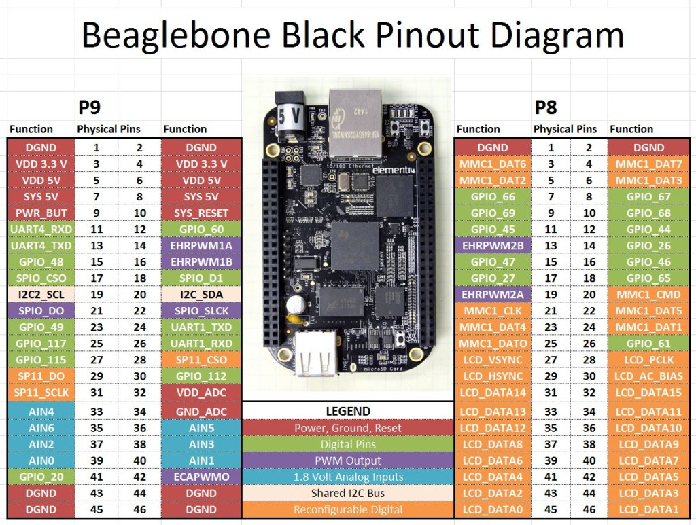

This folder contains all of the setup information for the BBB. Device tree overlays, pinout information, kernal modules, and a script to set everything up.

# How to apply settings
1. Copy over all `.dts` files to the BBB using `scp`
2. Copy over the `initOverlay` script to the BBB   
3. Run the `./initOverlay` script. This must be in the same directory as the `.dts` files. Change the permissions of this file if necessary

# BBB setup includes: 
* CAN Bus device tree overlay and kernal module setup
  * [Reference here](https://electronics.stackexchange.com/questions/195416/beaglebone-black-can-bus-setup)
  * Device tree _and_ kernal modules will be needed. Likely additional can utils will need to be installed.
  * Run `ifconfig` to see if can0 shows up. The device will need to be connected before anything will show up.
* ADC input device tree overlay setup
  * [Reference here](https://www.teachmemicro.com/beaglebone-black-adc/)
  * Look in the `/sys/bus/iio/devices/iio:device0` folder for ADC values
* PWM output device tree overlay setup
  * [Reference here](https://www.teachmemicro.com/beaglebone-black-pwm-ubuntu-device-tree/)
  * Look in the `/sys/class/pwm/pwmchip0/pwm0/` folder for the ability to write to PWM
  * The above was setup following instructions in the reference guide.
* GPIO input for PRU, for Optical inputs, device tree overlay setup
  * Great guide on setting the PRUSS (Programmable Real-time Unit Sub System). [Derek Molloy's site](http://exploringbeaglebone.com/chapter13/)
  * [Device-Tree Overlay Generator](http://www.kilobaser.com/blog/2014-07-28-beaglebone-black-devicetreeoverlay-generator). 
* GPIO output device tree overlay setup
  * [Device-Tree Overlay Generator](http://www.kilobaser.com/blog/2014-07-28-beaglebone-black-devicetreeoverlay-generator). 
* One-Wire communication protocol for DS18B20 temperature sensor device tree overlay
  * [Reference here](http://www.bonebrews.com/temperature-monitoring-with-the-ds18b20-on-a-beaglebone-black/).
  * Check the comments, there are syntax errors. There is a missing `;` on line 37.
  * Look in `/sys/devices/` for the sensors. They must be plugged in before anything will show up.
* I2C is already enabled by default by the kernal. On I2C2 bus.
* View all device trees on BBB: `dtc -f -I fs /proc/device-tree | less `

# Pin reference
* The two PDFs in this directory contain detailed information about each header. 
* CAN Bus 
  * P9-24 (CAN RX) and P9-26 (CAN TX).
* ADC 
  * P9-33 through P9-40
* PWM
  * P9-14 (EHRPWM1A) or P9-16 (EHRPWM1B)
* GPIO input for PRU, Optical sensors
  * P8-27 through P8-29, and P8-39 through P8-46
* GPIO output 
  * P8-22 through P8-26
* DS18B20 temperature sensors
  * P8-11
* I2C2
  * P9-19 and P9-20
* 

